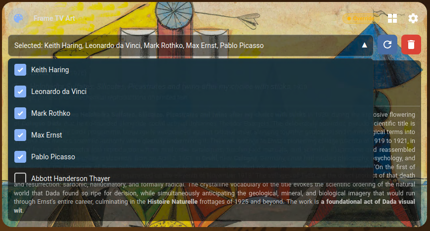
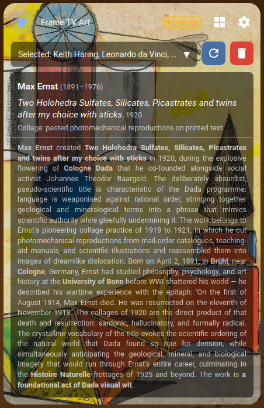

# Samsung Frame TV Art Card

[](https://www.buymeacoffee.com/kohlerryan)

A custom [Home Assistant](https://www.home-assistant.io/) Lovelace card for controlling a Samsung Frame TV art display — browse collections, trigger artwork reseeds, and monitor live refresh progress, all from your HA dashboard.


---

> **Upgrading from v0.1.x?** See the [v0.2.0 release notes](https://github.com/kohlerryan/samsung-tv-art-card/releases/tag/v0.2.0) for breaking changes and what's new.

> **Upgrading from v0.2.x?** See the [v0.3.1 release notes](https://github.com/kohlerryan/samsung-tv-art-card/releases/tag/v0.3.1) for what's new.

---

## Features

- **Artwork display** — shows the currently active image with artist name, title, year, medium, and description pulled from MQTT sensor attributes
- **Collection selector** — multi-select dropdown to choose which art collections the TV should cycle through

  
- **Settings cog → web UI** — the cog button opens the standalone [Samsung TV Art Uploader](https://github.com/kohlerryan/samsung-tv-art-uploader) web UI in a new tab. All slideshow editing, per-image matte selection, saved selections, and backend settings live there. Set `web_ui_url` in the card config to enable (see [Dashboard card](#dashboard-card) below). The card itself stays focused on showing the currently active artwork and switching collections from the dashboard.
- **Not in art mode state** — when the TV is not in Art Mode the card collapses to a compact row showing the card title and a subtle "TV is not in art mode" label; controls are hidden until art mode resumes

  
- **Fixed / dynamic layout** — `fixed` mode (default) constrains the card to a 16:9 aspect ratio matching the TV; when artwork metadata overflows the info area a soft fade indicates more content, and tapping the info panel opens a floating detail overlay without growing the card. `dynamic` mode retains the original behaviour where the card grows with content (see [Layout mode](#layout-mode) below)
- **Refresh** — clears uploads and re-seeds the TV with a fresh randomised set
- **Update & Refresh** — fetches the latest collection updates from git, rebuilds the artwork database, then re-seeds
- **Live progress log** — real-time status messages streamed from the backend during any refresh operation; state is preserved across page reloads for up to 15 minutes
- **Mixed-content safe** — resolves image paths over HTTP or HTTPS to match the HA frontend protocol

> **Why open the web UI instead of editing in the dashboard?** The card used to host slideshow editing, matte pickers, presets, and settings as in-card popups. As those features grew (drag-reorder, per-image matte, modal preview, autosave) the popup UX hit hard ceilings inside the Lovelace context. Pointing the cog at the real web UI keeps the card simple and lets the full editor live where it works best.

---

## Installation

### Option A — HACS

1. In HACS → **Frontend** → ⋮ → **Custom repositories**, add:
   - **URL**: `https://github.com/kohlerryan/samsung-tv-art-card`
   - **Category**: Lovelace
2. Click **Install** on the Samsung TV Art Card entry.
3. Reload the browser.

### Option B — Manual

1. Copy `samsung-tv-art-card.js` into your HA config directory:
   ```bash
   mkdir -p <ha-config>/www/samsung-tv-art-card/
   cp samsung-tv-art-card.js <ha-config>/www/samsung-tv-art-card/
   ```

2. Register the resource in `configuration.yaml`:
   ```yaml
   lovelace:
     resources:
         url: /local/samsung-tv-art-card/samsung-tv-art-card.js?v=v0.3.1
         type: module
   ```

3. Restart Home Assistant.

---

## Dashboard card

Add the card to any dashboard view. Minimal configuration:

```yaml
type: custom:frame-tv-art-card
title: Frame TV Art
image_path: /local/images/frame_tv_art_collections
web_ui_url: http://samsung-tv-art.local:8080
```

The `web_ui_url` is the address of the standalone web UI (typically port `8080` on the host running the `samsung-tv-art` container). It defaults to `http://samsung-tv-art.local:8080` (the mDNS hostname the container advertises) so most installs work without setting it. Override it if your container is reachable at a different host/port. Clicking the cog in the card header opens that URL in a new tab \u2014 all slideshow editing, matte selection, presets, and backend settings live there.

> **HTTPS Home Assistant + HTTP uploader:** opening the URL in a new tab works fine (top-level navigation is allowed cross-scheme), but the browser may show a "Not Secure" warning on the uploader tab. If you'd prefer no warning, run the uploader behind a reverse proxy (Caddy add-on, NGINX Proxy Manager add-on, Traefik, etc.) and point `web_ui_url` at the HTTPS host.

All entity and MQTT topic names default to the values published by the `samsung-tv-art` backend container and can be overridden if needed:

```yaml
type: custom:frame-tv-art-card
title: Frame TV Art
image_path: /local/images/frame_tv_art_collections
web_ui_url: http://samsung-tv-art.local:8080

# Override only if your sensor names differ from the defaults
settings_entity: sensor.frame_tv_art_settings
collections_entity: sensor.frame_tv_art_collections
selected_artwork_file_entity: sensor.frame_tv_art_selected_artwork
selected_collections_entity: sensor.frame_tv_art_selected_collections

# Override only if your MQTT topics differ
refresh_cmd_topic: frame_tv/cmd/collections/refresh
refresh_ack_topic: frame_tv/ack/collections/refresh
sync_ack_topic: frame_tv/ack/settings/sync_collections
```

### Optional: add the web UI as a sidebar item

If you'd rather stay inside Home Assistant when editing, you can pin the web UI to the HA sidebar with the built-in `panel_iframe` integration (no extra software needed). Add to `configuration.yaml`:

```yaml
panel_iframe:
  frame_tv_art:
    title: Frame TV Art
    icon: mdi:palette
    url: http://samsung-tv-art.local:8080
    require_admin: false
```

> **Caveat — mixed content:** browsers refuse to load an HTTP iframe inside an HTTPS page, with no override. If your HA frontend is served over HTTPS (Nabu Casa, DuckDNS+LE, a reverse proxy in front of HA, etc.) the iframe will appear blank or show a security error. To make the sidebar option work you either need:
>
> - an HTTP HA frontend (LAN-only setups), **or**
> - the uploader served over HTTPS too (reverse proxy with a cert).
>
> The cog-opens-new-tab behaviour above does **not** have this problem because top-level navigation between schemes is allowed by browsers.

---

## Layout mode

The card supports two layout modes controlled by the `layout_mode` key. The default is `fixed`.

| Mode | Behaviour |
|---|---|
| `fixed` *(default)* | Card height is fixed to the **16:9 aspect ratio** of the TV image. When the artwork description overflows the info area a soft fade appears as a tap hint. Tapping the info panel opens a **floating detail overlay** (centered, scrollable, up to 80 vh) that floats above other dashboard content — the card itself never grows. |
| `dynamic` | Original behaviour — card grows vertically with its content. All metadata is always visible with no overlay. |

| Fixed layout | Fixed layout — art detail overlay |
|---|---|
|  |  |

| Dynamic layout |
|---|
|  |

To switch to dynamic mode add `layout_mode: dynamic` to your card YAML:

```yaml
type: custom:frame-tv-art-card
title: Frame TV Art
image_path: /local/images/frame_tv_art_collections
layout_mode: dynamic
```

---

## Version

Current version: **v0.3.1** — bump the `?v=` cache-buster in the resource URL whenever you upgrade.
