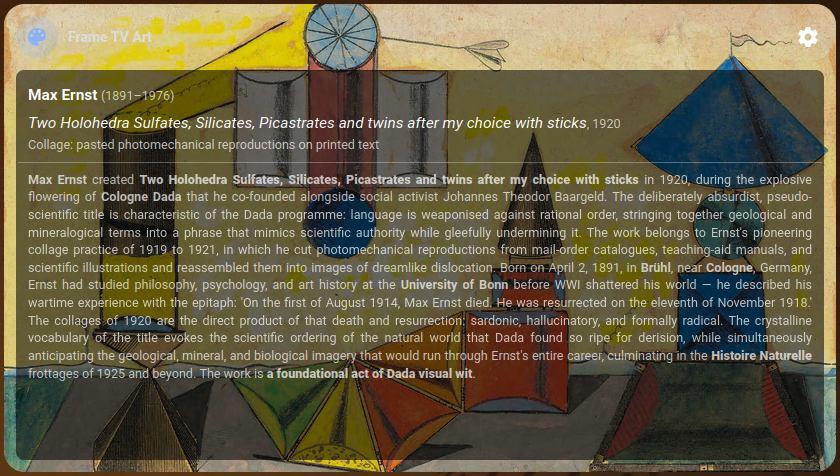
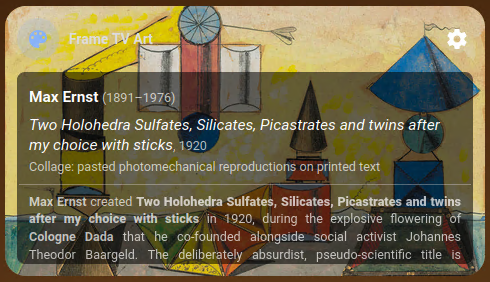
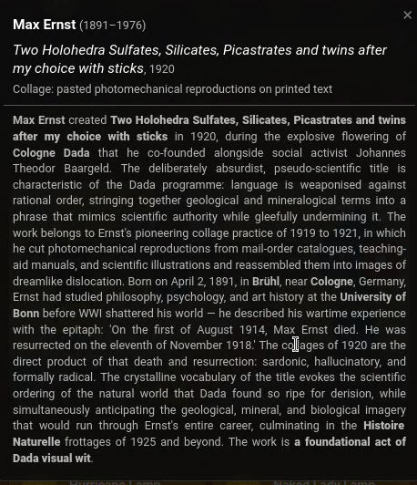
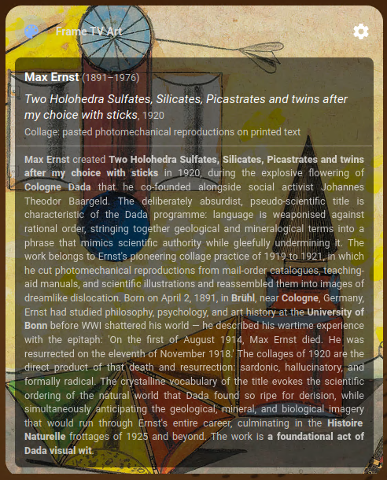

# Samsung Frame TV Art Card

[](https://www.buymeacoffee.com/kohlerryan)

A viewer-only [Home Assistant](https://www.home-assistant.io/) Lovelace card for a Samsung Frame TV art display — shows the currently active artwork with full metadata, and opens the standalone [Samsung TV Art Uploader](https://github.com/kohlerryan/samsung-tv-art-uploader) web UI for any configuration.

---

> **Breaking change in v0.4.0 — viewer-only rewrite**
>
> **If you are upgrading from v0.1.x – v0.3.x, read this before reloading.** The card is now a pure viewer; every editing control has been removed and the cog now opens the standalone [web UI](https://github.com/kohlerryan/samsung-tv-art-uploader) in a new tab.
>
> **Removed from the card itself:**
> - In-card collection dropdown and Apply / Clear buttons
> - Refresh and Update & Refresh actions
> - All in-card MQTT subscriptions
> - Live progress log inside the card body
> - Slideshow editor, preset / saved-selection picker, and matte controls
>
> **Removed config keys** (delete these from your card YAML, they will be ignored):
> - `settings_entity`
> - `collections_entity`
> - `selected_collections_entity`
> - `refresh_cmd_topic`
> - `refresh_ack_topic`
> - `sync_ack_topic`
>
> **New required setup:** set [`web_ui_url`](#dashboard-card) to the address of your uploader instance (defaults to `http://samsung-tv-art.local:8080`). The cog opens that URL in a new tab; all editing now lives there. See the [v0.4.0 release notes](https://github.com/kohlerryan/samsung-tv-art-card/releases/tag/v0.4.0) for the full migration guide.
>
> **Upgrading from v0.1.x?** Also see the [v0.2.0 release notes](https://github.com/kohlerryan/samsung-tv-art-card/releases/tag/v0.2.0) for prior breaking changes.

---



---

## Features

- **Artwork display** — shows the currently active image with artist name, title, year, medium, and description pulled from MQTT sensor attributes
- **Settings cog → web UI** — the cog button opens the standalone [Samsung TV Art Uploader](https://github.com/kohlerryan/samsung-tv-art-uploader) web UI in a new tab. All collection selection, slideshow editing, per-image matte selection, saved selections, refresh / re-seed actions, and backend settings live there. Set `web_ui_url` in the card config to point at your install (see [Dashboard card](#dashboard-card) below).
- **Not in art mode state** — when the TV is not in Art Mode the card collapses to a compact row showing the card title and a subtle "TV is not in art mode" label

  
- **Fixed / dynamic layout** — `fixed` mode (default) constrains the card to a 16:9 aspect ratio matching the TV; when artwork metadata overflows the info area a soft fade indicates more content, and tapping the info panel opens a floating detail overlay without growing the card. `dynamic` mode retains the behaviour where the card grows with content (see [Layout mode](#layout-mode) below)
- **Standby progress log** — while the TV is reseeding, live status messages from the backend (`frame_tv/log` MQTT topic) are shown below the standby image so you can see what's happening
- **Mixed-content safe** — resolves image paths over HTTP or HTTPS to match the HA frontend protocol

> **Why viewer-only?** The card used to host the full collection selector, refresh actions, slideshow editor, matte pickers, presets, and settings inline. As those features grew, the in-card UX hit hard ceilings inside the Lovelace context. v0.4.0 ships the card as a pure viewer and points the cog at the real web UI where the full editor lives.

---

## Installation

### Option A — HACS

1. In HACS → **Frontend** → ⋮ → **Custom repositories**, add:
   - **URL**: `https://github.com/kohlerryan/samsung-tv-art-card`
   - **Category**: Lovelace
2. Click **Install** on the Samsung TV Art Card entry.
3. Reload the browser.

### Option B — Manual

1. Copy `samsung-tv-art-card.js` into your HA config directory:
   ```bash
   mkdir -p <ha-config>/www/samsung-tv-art-card/
   cp samsung-tv-art-card.js <ha-config>/www/samsung-tv-art-card/
   ```

2. Register the resource in `configuration.yaml`:
   ```yaml
   lovelace:
     resources:
         url: /local/samsung-tv-art-card/samsung-tv-art-card.js?v=v0.4.0
         type: module
   ```

3. Restart Home Assistant.

---

## Dashboard card

Add the card to any dashboard view. Minimal configuration:

```yaml
type: custom:frame-tv-art-card
title: Frame TV Art
image_path: /local/images/frame_tv_art_collections
web_ui_url: http://samsung-tv-art.local:8080
```

The `web_ui_url` is the address of the standalone web UI (typically port `8080` on the host running the `samsung-tv-art` container). It defaults to `http://samsung-tv-art.local:8080` (the mDNS hostname the container advertises) so most installs work without setting it. Override it if your container is reachable at a different host/port. Clicking the cog in the card header opens that URL in a new tab \u2014 all slideshow editing, matte selection, presets, and backend settings live there.

> **HTTPS Home Assistant + HTTP uploader:** opening the URL in a new tab works fine (top-level navigation is allowed cross-scheme), but the browser may show a "Not Secure" warning on the uploader tab. If you'd prefer no warning, run the uploader behind a reverse proxy (Caddy add-on, NGINX Proxy Manager add-on, Traefik, etc.) and point `web_ui_url` at the HTTPS host.

All defaults match what the `samsung-tv-art` backend container publishes. Only override if your install differs:

```yaml
type: custom:frame-tv-art-card
title: Frame TV Art
image_path: /local/images/frame_tv_art_collections
web_ui_url: http://samsung-tv-art.local:8080

# Override only if your sensor name differs from the default
selected_artwork_file_entity: sensor.frame_tv_art_selected_artwork

# Optional — explicit standby image override (otherwise <image_path>/standby.png)
standby_image_path: /local/images/frame_tv_art_collections/standby.png
```

### Optional: add the web UI as a sidebar item

If you'd rather stay inside Home Assistant when editing, you can pin the web UI to the HA sidebar with the built-in `panel_iframe` integration (no extra software needed). Add to `configuration.yaml`:

```yaml
panel_iframe:
  frame_tv_art:
    title: Frame TV Art
    icon: mdi:palette
    url: http://samsung-tv-art.local:8080
    require_admin: false
```

> **Caveat — mixed content:** browsers refuse to load an HTTP iframe inside an HTTPS page, with no override. If your HA frontend is served over HTTPS (Nabu Casa, DuckDNS+LE, a reverse proxy in front of HA, etc.) the iframe will appear blank or show a security error. To make the sidebar option work you either need:
>
> - an HTTP HA frontend (LAN-only setups), **or**
> - the uploader served over HTTPS too (reverse proxy with a cert).
>
> The cog-opens-new-tab behaviour above does **not** have this problem because top-level navigation between schemes is allowed by browsers.

---

## Layout mode

The card supports two layout modes controlled by the `layout_mode` key. The default is `fixed`.

| Mode | Behaviour |
|---|---|
| `fixed` *(default)* | Card height is fixed to the **16:9 aspect ratio** of the TV image. When the artwork description overflows the info area a soft fade appears as a tap hint. Tapping the info panel opens a **floating detail overlay** (centered, scrollable, up to 80 vh) that floats above other dashboard content — the card itself never grows. |
| `dynamic` | Original behaviour — card grows vertically with its content. All metadata is always visible with no overlay. |

| Fixed layout | Fixed layout — art detail overlay |
|---|---|
|  |  |

| Dynamic layout |
|---|
|  |

To switch to dynamic mode add `layout_mode: dynamic` to your card YAML:

```yaml
type: custom:frame-tv-art-card
title: Frame TV Art
image_path: /local/images/frame_tv_art_collections
layout_mode: dynamic
```

---

## Version

Current version: **v0.4.0** — bump the `?v=` cache-buster in the resource URL whenever you upgrade.
